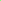
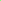
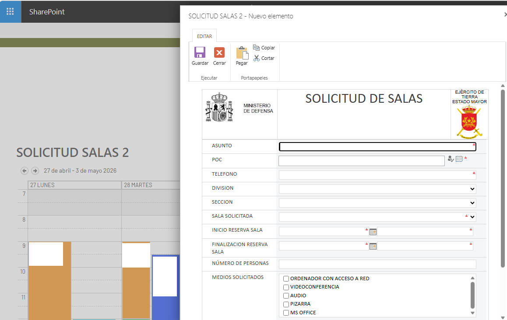
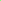
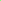

# ET_MeetingRoom_ePaperSign

Integrated electronic ink sign for meeting rooms based on SeeedStudio devices — a lightweight REST API wrapper running on a **Seeed Studio XIAO ESP32-S3** that bridges a **reTerminal E1002 Full-color ePaper Display** with a **SharePoint Server 2019** room-booking calendar.

---

## Table of Contents

1. [Project Purpose](#project-purpose)
2. [Hardware Involved](#hardware-involved)
3. [Solution Architecture](#solution-architecture)
4. [API Flow and HMI Application Sequence](#api-flow-and-hmi-application-sequence)
5. [Data Source Maintenance — SharePoint Booking Form](#data-source-maintenance--sharepoint-booking-form)
6. [reTerminal E1002 Configuration Steps](#reterminal-e1002-configuration-steps)
7. [Device-Facing Endpoints](#device-facing-endpoints)
8. [Implementation Notes](#implementation-notes)
9. [Uploading Firmware to the XIAO ESP32-S3](#uploading-firmware-to-the-xiao-esp32-s3)
10. [Security Notes](#security-notes)
11. [Recommended Production Approach](#recommended-production-approach)

---

## Project Purpose

Digital signage has always been at the forefront of keeping teams informed. With powerful intranet tools like **SharePoint** driving modern collaboration, this project connects your SharePoint room-booking list directly to ePaper screens deployed across your facilities.

Key goals:

- **No cloud dependency.** All communication remains on-premises; the cloud and on-premises environments are completely decoupled.
- **Military-grade security criteria.** Designed and tested in Spanish Army facilities: no internal credentials are exposed externally, and SharePoint access tokens persist only in firmware.
- **Lightweight and self-contained.** The XIAO ESP32-S3 acts as a micro-proxy, caching results locally and translating SharePoint OData JSON into simple arrays that the ePaper terminal can consume directly.

---

## Hardware Involved

| Component | Role |
|-----------|------|
| [Seeed Studio XIAO ESP32-S3](https://wiki.seeedstudio.com/xiao_esp32s3_getting_started/) | API Wrapper — runs the firmware in this repository |
| [Seeed Studio reTerminal E1002](https://wiki.seeedstudio.com/reterminal_e1002/) | Full-color ePaper Display — consumes the wrapper API |
| Internal LAN / Wi-Fi AP | Transport between all three components |
| SharePoint Server 2019 (on-premises) | Authoritative data source for room bookings |

---

## Solution Architecture

```
reTerminal E1002          XIAO ESP32-S3 Wrapper         SharePoint Server 2019
(ePaper Display)          (this firmware)                (on-premises)
       │                          │                              │
       │  GET /rooms?part=…       │                              │
       │  numSala: SALA_01        │                              │
       │  clave: <secret>         │                              │
       │─────────────────────────>│                              │
       │                          │  GET /sites/reservas/…       │
       │                          │  Authorization: Bearer <tok> │
       │                          │─────────────────────────────>│
       │                          │        OData JSON            │
       │                          │<─────────────────────────────│
       │                          │  (transform + cache)         │
       │       JSON array         │                              │
       │<─────────────────────────│                              │
```



The wrapper validates every incoming request from the display, fetches data from SharePoint with a Bearer token, normalises datetime fields, and returns clean JSON arrays. Responses are cached for a configurable TTL (default 60 s) to reduce SharePoint load and provide resilience if SharePoint is temporarily unavailable.

---

## API Flow and HMI Application Sequence



1. The reTerminal E1002 boots and loads the SenseCraft HMI page.
2. The HMI page fires two sequential HTTP GET requests to the XIAO wrapper:
   - `GET /rooms?part=headers` → receives column names.
   - `GET /rooms?part=data` → receives a 2-D array of booking rows.
3. The wrapper validates `numSala` and `clave` headers.
4. On a cache miss (or expired cache), the wrapper calls the SharePoint REST API with a Bearer token.
5. The response is transformed and cached; the display renders the table.

---

## Data Source Maintenance — SharePoint Booking Form

Room reservations are maintained in a SharePoint list called **Reservas**. Staff create and edit bookings through a standard SharePoint list form.



The list exposes the following fields consumed by the wrapper:

| SharePoint field | Display label |
|-----------------|---------------|
| `Title` / `Asunto` | Asunto (subject) |
| `Division` | División |
| `Seccion` | Sección |
| `InicioReservaSala` | Inicio (start time) |
| `FinalizacionReservaSala` | Fin (end time) |

---

## reTerminal E1002 Configuration Steps

### Create the page with SenseCraft HMI

Use the [SenseCraft HMI web application](https://sensecraft.seeed.cc/) to design the display page and bind the two data sources.



### Set up the data source connection

Configure each data source in SenseCraft HMI to point to the XIAO wrapper IP address, adding the required `numSala` and `clave` custom headers.



---

## Device-Facing Endpoints

All endpoints are served by the XIAO ESP32-S3 over plain HTTP on port **80**.

### `GET /health`

Returns a simple liveness check. No authentication required.

```
HTTP/1.1 200 OK
Content-Type: application/json

{"status":"ok"}
```

---

### `GET /rooms?part=headers`

Returns the column names for the booking table.

**Required request headers**

| Header | Description |
|--------|-------------|
| `numSala` | Room identifier (e.g. `SALA_01`) |
| `clave` | Shared secret that authorises this device |

**Success response — 200 OK**

```json
[
  "Asunto",
  "División",
  "Sección",
  "Inicio",
  "Fin"
]
```

---

### `GET /rooms?part=data`

Returns all bookings for the requested room as a 2-D array.

**Required request headers** — same as above.

**Success response — 200 OK**

```json
[
  [
    "GT Reorganización",
    "SEGENEME",
    "SEAPO",
    "2026-04-29T09:00",
    "2026-04-29T12:00"
  ],
  [
    "REUNIÓN GESTIÓN IPAC",
    "DIVPLA",
    "SEPO",
    "2026-04-29T12:00",
    "2026-04-29T13:30"
  ]
]
```

---

### Error responses

| HTTP status | Condition |
|-------------|-----------|
| `400 Bad Request` | Missing or invalid `part` query parameter |
| `401 Unauthorized` | Missing or invalid `numSala` or `clave` header |
| `502 Bad Gateway` | SharePoint unreachable and no valid cached data available |

---

## Implementation Notes

### Request headers sent by the reTerminal

Every request from the reTerminal E1002 must include:

```
numSala: SALA_01
clave: DEVICE_SECRET_123
```

The XIAO wrapper checks both headers before processing any request. Requests that omit or supply incorrect values are rejected with **HTTP 401**.

### SharePoint authorisation

The wrapper authenticates to SharePoint using a Bearer token:

```cpp
String bearerHeader = "Bearer " + accessToken;
http.addHeader("Authorization", bearerHeader);
```

The token and SharePoint URL are stored in `include/config.h` (derived from `include/config.example.h`).

### SharePoint REST query

```
GET https://sharepoint.company.local/sites/reservas/_api/web/lists/getbytitle('Reservas')/items
    ?$select=Title,Division,Seccion,InicioReservaSala,FinalizacionReservaSala
    &$orderby=InicioReservaSala%20asc
Accept: application/json;odata=nometadata
Authorization: Bearer <accessToken>
```

### Datetime normalisation

SharePoint ISO-8601 strings (e.g. `2026-04-29T09:00:00Z`) are trimmed to `YYYY-MM-DDTHH:mm` before being returned to the display.

### Caching

- Cache TTL is configurable via `CACHE_TTL_MS` (default: `60000` ms).
- If SharePoint is unreachable but valid cached data exists, the wrapper returns the cached data instead of a 502 error.
- If the cache is empty **and** SharePoint is unreachable, the wrapper returns **HTTP 502**.

---

## Uploading Firmware to the XIAO ESP32-S3

### Prerequisites

1. **Arduino IDE 2.x** (or PlatformIO).
2. **ESP32 board package** — add `https://raw.githubusercontent.com/espressif/arduino-esp32/gh-pages/package_esp32_index.json` to *Preferences → Additional Boards Manager URLs* and install **esp32 by Espressif Systems**.
3. **Libraries** (install via Library Manager):
   - `ArduinoJson` by Benoit Blanchon (≥ 6.x)
   - `WebServer` (included with the ESP32 board package)
   - `HTTPClient` (included with the ESP32 board package)
   - `WiFi` (included with the ESP32 board package)

### Configuration

1. Copy `include/config.example.h` to `include/config.h`.
2. Fill in your values:

```cpp
#define WIFI_SSID               "YourNetworkSSID"
#define WIFI_PASSWORD           "YourNetworkPassword"
#define EXPECTED_NUM_SALA       "SALA_01"
#define EXPECTED_CLAVE          "DEVICE_SECRET_123"
#define SHAREPOINT_ACCESS_TOKEN "eyJ0eXAiOiJKV1Qi..."
#define SHAREPOINT_URL          "https://sharepoint.company.local/sites/reservas/_api/web/lists/getbytitle('Reservas')/items?$select=Title,Division,Seccion,InicioReservaSala,FinalizacionReservaSala&$orderby=InicioReservaSala%20asc"
#define CACHE_TTL_MS            60000
```

3. **Never commit `include/config.h`** — it is listed in `.gitignore`.

### Upload

1. Connect the XIAO ESP32-S3 via USB-C.
2. Select **Board:** *XIAO_ESP32S3* and the correct **Port**.
3. Click **Upload**.
4. Open the Serial Monitor at **115200 baud** to verify Wi-Fi connection and the IP address assigned to the wrapper.

---

## Security Notes

- **Do not hardcode long-lived production SharePoint tokens in firmware.** Tokens embedded in firmware are retrievable by anyone with physical access to the device.
- **Use HTTPS** for all SharePoint requests (`WiFiClientSecure` with certificate validation or at minimum fingerprint pinning).
- **Use a restricted read-only SharePoint service identity** — the service account must have the minimum permissions needed to read the Reservas list.
- **Consider an internal proxy** if SharePoint requires NTLM, Kerberos, SAML, claims-based authentication, or any token-refresh flow too complex for the ESP32 runtime.
- **Protect the wrapper endpoint** with `numSala` and `clave` headers and rotate `clave` periodically.
- **Avoid logging** access tokens or secrets to Serial output, especially in production firmware builds.

---

## Recommended Production Approach

| Concern | Recommendation |
|---------|---------------|
| Token lifetime | Use a short-lived OAuth 2.0 client-credentials token (if SharePoint is configured for it) and implement token refresh on the ESP32, or delegate refresh to an internal proxy. |
| Secret provisioning | Provision `clave` and `accessToken` over a secure local channel (e.g. a one-time BLE/serial setup flow) rather than hard-coding them in the sketch. |
| TLS | Enable `WiFiClientSecure` with the SharePoint server certificate or its CA fingerprint to prevent MITM attacks on the internal network. |
| Firmware updates | Use OTA update mechanisms (`ArduinoOTA` or a custom HTTP OTA handler) so production tokens can be rotated without physical access. |
| Network segmentation | Place the XIAO ESP32-S3 on a dedicated IoT VLAN that can reach the SharePoint server but is isolated from general corporate traffic. |
